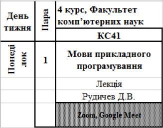
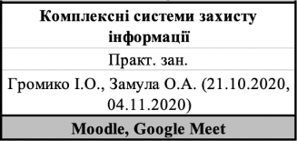
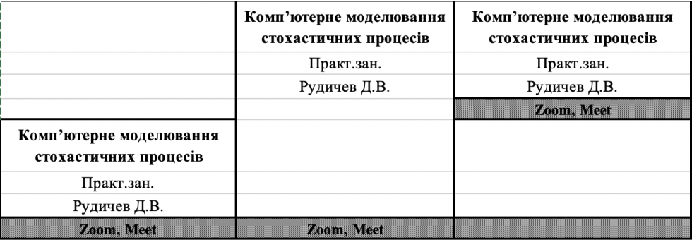
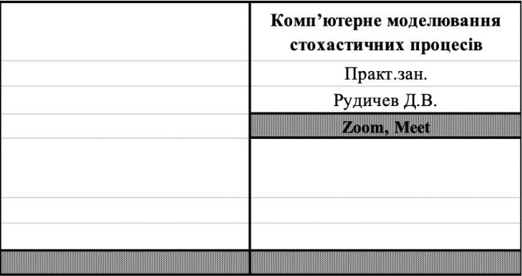
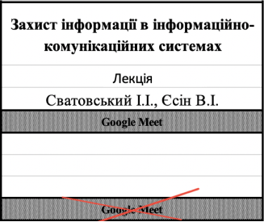
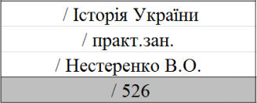
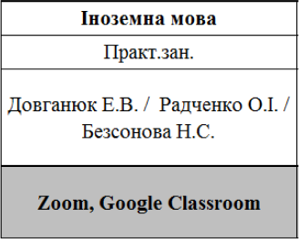
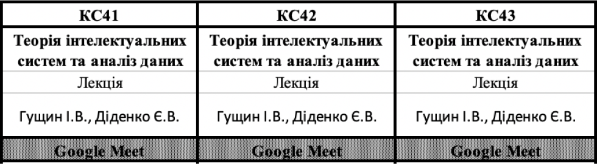
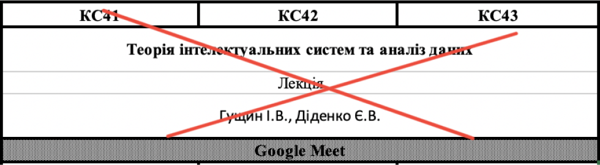

 
  
 ## Language:     
- [ua](#ua)    
- [ru](#ru)   
    
# UA     

 - [Загальні вимоги](#загальні-вимоги)    
 - [Вимоги до дня](#вимоги-до-дня)    
	 - [Зразок розкладу на декілька днів](#зразок-розкладу-на-декілька-днів)
		 - [Початок розкладу для кожного дня](#початок-розкладу-для-кожного-дня)
		 - [Рядки](#рядки)
		 - [Стовпці](#стовпці)
 - [Вимоги до об'єкту предмета](#вимоги-до-об'єкта-предмета)
     - [Час проведення заняття](#час-проведення-заняття) 
     - [Дати та проміжки дат](#дати-та-проміжки-дат)
	 - [Структура для мигалок](#структура-для-мигалок)
		 - [Примітки](#примітки)
	 - [Структура для пустих пар](#структура-для-пустих-пар)
		 - [З мигалкою](#з-мигалкою)
		 - [Без мигалок](#без-мигалок)
		 - [Відсутня пара](#відсутня-пара)
		 - [Обмеження](#обмеження)
     - [Структура для підгруп](#структура-для-підгруп)
 - [Пари для декількох груп](#пари-для-декількох-груп)
 - [Міжфакультетська дисципліна та Фізичне виховання](#міжфакультетська-дисципліна-та-фізичне-виховання)
 - [Помітки](#помітки) 
  
    
## Загальні вимоги  
 
 1. Файл повинен мати розширення `.xlsx`.   
 2. **Не порожній** файл повинен зберігати структуру [початку розкладу для кожного дня](#Початок-розкладу-для-кожного-дня).
 3. Розклад для кожного курсу повинен бути на окремому **листі** xlsx документа:
 
    
    
    
## Вимоги до дня 
  
### Зразок розкладу на декілька днів  

 
  
 > Структура зберігається для кожного дня! 

#### Початок розкладу для кожного дня  
  
Обов'язкова структура:
  
  
  
#### Рядки  
  
1. № курсу та факультету.
  
    |           ✅ Do this                |❌ Don't do this |    
    |-------------------------------------|----------------|  
	| 4 курс, Факультет комп’ютерних наук |  Курс 4, ФКН   |  
	
2. Назва групи.
3.   
      |Назва тижня|№ пари|Назва предмету                |  
      |-----------|------|------------------------------| 
      |Понеділок  |1     |Мови прикладного програмування|  
  
#### Стовпці
  
1. День тижня.
2. Номер пари.
3. Кожна наступна – група для якої буде розклад.
  
  
## Вимоги до об'єкта предмета   
  
  
|Structure   |Структура       |Приклад                       |  
|:-----------|:---------------|:-----------------------------|  
|Subject name|Назва предмету  |Мови прикладного програмування|  
|Type        |Тип             |Лекція                        |  
|Teacher     |Викладач        |Рудичев Д.В.                  |  
|Location    |Місце проведення|Zoom, Google Meet             |  
  
**Type:** 
  * Допустимі значення: `Консультація`, `Лекція`, `Практ.зан.`.
  * В іншому випадку буде встановлено: `Практ.зан.`.
  * Якщо нічого не встановлено – поле залишиться пустим.
  
**Teacher:**
  * Допустимі значення: використовувати шаблон `Прізвище та ініціали` (ex: _Стєрвоєдов М.Г._).
  _(Рекомендовано) вказувати крапку в ініціалах_.
  * Якщо нічого не встановлено – поле залишиться пустим.
  * Ступінь: **вказувати не потрібно!**
  
      |✅ Do this |❌ Don't do this|    
      |-----------|----------------|  
      |Ткачук М.В.|проф.Ткачук М.В.|
      
  * Перерахування вказувати через **кому**
  * Розширення функціоналу: [див. Дати та проміжки дат](#дати-та-проміжки-дат)
  
**Location:**
  * Перерахування вказувати через **кому** (ex: _Moodle, Google Meet_)
  
    |✅ Do this      |❌ Don't do this               |    
    |---------------|-------------------------------|  
    |526, 527       |526;527                        |
    |Google Meet    |Meet                           |
    |Google Class   |Google Class Room or Class Room|

 * Якщо місце проведення (online) невідоме, варто вказати `дист.` (дистанційно).

### Час проведення заняття

Якщо заняття має не стандартний час або протяжність проведення – вкажіть цей спеціальний час після назви предмету за наступним форматом:

    
### Дати та проміжки дат

Якщо потрібно встановити для предмета особливу дату, або ж проміжок дат – скористайтеся одним з варіантів:
   1. (**з** _dd.mm.yyyy_)
   2. (**до** _dd.mm.yyyy_)
   3. (**з** _dd.mm.yyyy_ **до** _dd.mm.yyyy_)
   4. (_dd.mm.yyyy_, _dd.mm.yyyy_)
   
   > **Обов'язково** варто вказати:
   > * `(` перед датою
   > * `)` в кінці.

   ‼️ Не використовуйте позначення року: `р.`
   
   |✅ Do this     |❌ Don't do this      |    
   |---------------|---------------------|  
   |(до 25.10.2020)|(до 25.10.2020**р.**)|
    
   * Перерахування вказувати через **кому**.
   
Використовуйте поле `teacher`, наприклад:

    
### Структура для мигалок  
  
  
  
1. У разі якщо є `верхня` та `нижня` мигалка **ОБОВ'ЯЗКОВО** потрібно вказати _**location**_ для обох предметів.
2. Якщо тільки `верхня` , то залишити пустими `4 рядки` **під** нею. 
    Варто пам'ятати про [обмеження!](#обмеження)
3. Якщо тільки `нижня`, то залишити пустими `4 рядки` **над** нею. 

#### Примітки  

Якщо в рядку пари, для всього потоку, є _предмет-мигалка_ і _звичайний-предмет_, то для другого варто залишити пустими `4 рядки` між _**teacher**_ і _**location**_.
  
Приклад:

   
   
   
### Структура для пустих пар  
  
#### З мигалкою  
  
Залишити `8 пустих рядків`.
  
  
  
#### Без мигалок  
  
Залишити `4 пустих рядки`.
  
  
  
#### Відсутня пара  
  
Залишити `4 пустих рядки` (_навіть якщо це для всього потоку_).   
> (Рекомендовано) Видалити останній, пустий рядок пари. 
> Або ж залишити `4 пусті рядки`.

#### Обмеження

Якщо `верхня` пара, то необхідно вказувати `location` в зазначеному для неї місці (**4-й рядок**).

### Структура для підгруп

Використовуй ` / ` для позначення підгруп.
* приклад позначення першої підгрупи 
    
* приклад позначення другої пігрупи 
    
* приклад позначення третьої підгрупи 
    
* приклад позначення першої та другої підгрупи 
    

Якщо деякі поля є загальними для всіх підгруп, можна позначити наступним чином:

    
## Пари для декількох груп

 ‼️ `Парсер не підтримує об'єднання колонок!`.
 
 
  
 
 
  > Використовуйте повторення пар для кожної групи.

## Міжфакультетська дисципліна та фізичне виховання  
  
Має зберігати основну структуру – `4 рядки`. 
  
  
   
## Помітки 
  
1. Файл може містити пусті сторінки (Не рекомендовано).
2. Парсер не підтримує об'єднання колонок, дані будуть використані лише для колонки в якій вони вказані.
3. Ніколи не залишайте пусті рядки, за виключенням ситуацій описаних в документі.

# RU

 - [Общие требования](#общие-требования)
 - [Требования ко дню](#требования-ко-дню)
    - [Образец расписания на день](#образец-расписания-на-несколько-дней)
    - [Начало расписания для каждого дня](#начало-расписания-для-каждого-дня)
    - [Строки](#строки)
    - [Колонки](#колонки)
 - [Требования к объекту предмета](#требования-к-объекту-предмета)
    - [Время проведения занятия](#время-проведения-занятия)
    - [Даты и промежутки дат](#даты-и-промежутки-дат)
    - [Структура для мигалки](#структура-для-мигалки)
        - [Примечания](#примечания)
    - [Структура для пустых пар](#структура-для-пустых-пар)
        - [С мигалкой](#с-мигалкой)
        - [Без мигалки](#без-мигалки)
        - [Отсутствует пара](#отсутствует-пара)
        - [Ограничение](#ограничение)
    - [Структура для подгрупп](#структура-для-подгрупп)
 - [Пары для нескольких групп](#пары-для-нескольких-групп)
 - [Межфакультетская дисциплина и Физическое воспитание](#межфакультетская-дисциплина-и-физическое-воспитание)
 - [Пометки](#пометки)
  
    
## Общие требования

 1. Файл должен иметь расширение `.xlsx`.
 2. **Не пустой** файл должен сохранять структуру [начало расписания для каждого дня](#начало-расписания-для-каждого-дня).
 3. Расписание для каждого курса должно быть на **отдельном листе** xlsx документа:
  
        
    
## Требования ко дню

### Образец расписания на несколько дней

  
 > Структура сохраняется для каждого дня!

#### Начало расписания для каждого дня
  
Обязательная структура:

  
#### Строки
  
   1. № курса и факультета.

      |           ✅ Do this                |❌ Don't do this |    
      |-------------------------------------|----------------|  
      | 4 курс, Факультет компьютерных наук |  Курс 4, ФКН   |
    
   2. Название группы.
   3.  
   
      | Наименование недели  | № пары | Наименование предмета              |
      | -------------------- | ------ | ---------------------------------- |
      | Понедельник          | 1      | Языки прикладного программирования |
  
#### Колонки
  
   1. День недели.
   2. Номер пары.
   3. Каждая последующая - группа для которой будет расписание.

  
## Требования к объекту предмета

  
| Structure    | Структура         | Пример                             |
| ------------ | ----------------- | ---------------------------------- |
| Subject name | Название предмета | Языки прикладного программирования |
| Type         | Тип               | Лекция                             |
| Teacher      | Преподаватель     | Рудычев Д.В.                       |
| Location     | Место проведения  | Zoom, Google Meet                  |
  
**Type:**
* Допустимые значения: `Консультация`, `Лекция`, `Практ.зан.`.
* В противном случае будет установлено: `Практ.зан.`.
* Если ничего не установлен - поле останется пустым
  
**Teacher:**
   * Допустимые значения: использовать шаблон `Фамилия и инициали` (ex: _Стервоедов М.Г._).  
    _(Рекомендовано) указывать точку в инициалах_.  
   * Если ничего не установлен - поле останется пустым.
   * Степень: **указывать не нужно!**
  
      | ✅ Do this | ❌ Do not do this |
      | ----------- | ---------------- |
      | Ткачук М.В. | проф.Ткачук М.В. |
      
   * Перечисление указывать через **запятую** 
  Расширение функционала: [см. Даты и промежутки дат](#даты-и-промежутки-дат)
  
**Location:**
   * Перечисление указывать через **запятую** (ex: _Moodle, Google Meet_)  
  
        |✅ Do this      |❌ Don't do this               |    
        |---------------|-------------------------------|  
        |526, 527       |526/527 or 526;527             |
        |Google Meet    |Meet                           |
        |Google Class   |Google Class Room or Class Room|

   * Если место проведения (online) неизвестно, стоит указать `дист.` (дистанционно)

### Время проведения занятия

Если занятие имеет не стандартное время или длительность проведения - укажите это специальное время после названия предмета в следующем формате:

    
### Даты и промежутки дат

Если нужно установить для предмета особую дату, или же промежуток дат - воспользуйтесь одним из вариантов:
   1. (**с** _dd.mm.yyyy_)
   2. (**до** _dd.mm.yyyy_)
   3. (**с** _dd.mm.yyyy_ **до** _dd.mm.yyyy_)
   4. (_dd.mm.yyyy_, _dd.mm.yyyy_)
   
   > **Обязательно** следует указать:
   > * `(` – перед датой 
   > * `)` – в конце.
   
   ‼️ Не используйте обозначения года: `р.`
      
  |✅ Do this     |❌ Don't do this      |    
  |---------------|---------------------|  
  |(до 25.10.2020)|(до 25.10.2020**р.**)|
      
   * Перечисление указывать через **запятую**.
 
Используйте поле `teacher`, например:

    
### Структура для мигалки
  

  
1. В случае если есть `верхняя` и `нижняя` мигалка **ОБЯЗАТЕЛЬНО** нужно указать _**location**_ для обоих предметов.
2. Если только `верхняя`, то оставить пустыми `4 строки` **под** ней  
    Стоит помнить о [ограничение!](#ограничение)
3. Если только `нижняя`, то оставить пустыми `4 строки` **над** ней.

#### Примечания

Если в строке пары, для всего потока, есть _предмет-мигалка_ и _обычный-предмет_, то для второго стоит оставить пустыми `4 строки` между _**teacher**_ и _**location**_.
  
Пример:

 
   
   
### Структура для пустых пар
  
#### С мигалкой
  
Оставить `8 пустых строк`.
  

  
#### Без мигалки
  
Оставить `4 пустые строки`.
  

  
#### Отсутствует пара
  
Оставить `4 пустые строки` (_даже если это для всего потока_).

> (Рекомендуется) Удалять последнюю, пустую, строку пара. 
> Либо оставить `4 пустые строки`.

#### Ограничение

Если `верхняя` пара, то необходимо указывать` location` в заданном ей месте (**4 строка**).

### Структура для подгрупп

Используй ` / ` для обозначения подгрупп.
* пример обозначения первой подгруппы 
  
* пример обозначения второй подгруппы 
  
* пример обозначения третьей подгруппы 
  
* пример обозначения первой и второй подгруппы 
  

Если некоторые поля являются общими для всех подгрупп, можно обозначить следующим образом:

## Пары для нескольких групп
 ‼️ `Парсер не поддерживает объединение колонок!`.
 
 
 
 
 
 > Используйте повторение пар для каждой группы.
 
## Межфакультетская дисциплина и физическое воспитание
  
Использовать основную структуру – `4 строки`.
  

   
## Пометки
1. Файл может содержать пустые страницы (Не рекомендуется!).
2. Парсер не поддерживает объединение колонок, данные будут использованы только для колонки в которой они указаны.
3. Никогда не оставлять пустые строки, за исключением ситуаций, которые описаны в документе.
